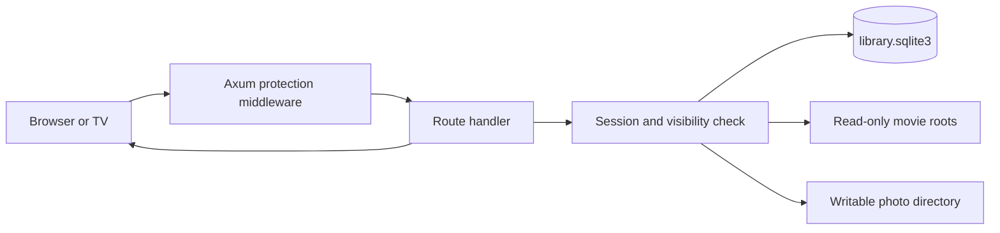

# Family Cinema architecture

## Purpose and boundaries

Family Cinema is a single-household media server. One Rust process serves the web interface, JSON APIs, video byte ranges, movie covers, and photo files. SQLite stores metadata. Movie files remain in configured read-only directories, while uploaded photos use a separate writable directory.

The application assumes a trusted home network. It does not provide TLS, internet-facing account management, live transcoding, DVD ripping, or official Plex protocol compatibility.

## Runtime components

| Component | Location | Responsibility |
| --- | --- | --- |
| Process entry point | `src/main.rs` | Read environment settings, handle `set-password`, scan movies, bind the HTTP listener, and stop cleanly on signals. |
| Application and movie catalog | `src/lib.rs` | Own shared state, migrate the core schema, scan media roots, authenticate Parents, serve embedded assets, list movies, and stream videos. |
| Movie covers | `src/covers.rs` | Authorize cover access, normalize uploads, find sidecar artwork, extract FFmpeg frames, and cache JPEG results. |
| Playback progress | `src/playback.rs` | Validate and persist shared resume positions for visible movies. |
| Photo albums | `src/photos.rs` | Manage album/photo metadata, validate uploads, create previews, move/rename/delete items, and serve stored images. |
| Storage reporting | `src/storage.rs` | Report filesystem capacity while counting each underlying filesystem once. |
| Movie interface | `web/app.js` | Profiles, login, movie cards, covers, playback, progress events, storage meter, and shared dialogs. |
| Photo interface | `web/photos.js` | Album browsing, uploads, photo preview, descriptions, renaming, moving, and deletion. |
| HTML and styles | `web/index.html`, `web/style.css`, `web/controls.css` | Accessible page structure, dialogs, responsive layout, compact controls, and tooltips. |

Web assets are compiled into the Rust binary with `include_str!`. Editing a web file therefore requires rebuilding the binary or Docker image.

## Request flow

Every non-GET/HEAD browser request must carry `X-Requested-With: custom-plex`. This blocks ordinary cross-site form submissions. Routes then apply their own authorization:

- Parents-only: scanning, movie-title changes, and Baby approval changes.
- Visible-movie access: streaming, covers, and playback progress. Parents can access all present movies; Baby can access approved movies only.
- Password-free photo access: album and photo reads and changes, matching the product requirement for the Photo Album profile.

## Shared state and concurrency

`App` is cloned into handlers. Its SQLite connection and login-attempt history are protected by mutexes. Cover generation and photo decoding share a one-permit Tokio semaphore because both operations can consume substantial memory on a Raspberry Pi.

Image decoding and filesystem-heavy work move to blocking worker threads. Video and photo downloads use `ServeFile`, which supports streaming and HTTP range requests without reading complete files into memory.

## Data model

| Table | Purpose | Durable identity |
| --- | --- | --- |
| `account` | One Argon2 Parents password hash | Fixed row `id=1` |
| `sessions` | Random eight-hour login tokens | Token |
| `movies` | Source, relative path, title, approval, and presence | `(source, path)` |
| `covers` | Uploaded or generated JPEG plus source fingerprint | Movie ID |
| `playback_progress` | Shared position, duration, and update time | Movie ID |
| `albums` | Album name, description, and recent-use ordering | Album ID |
| `photos` | Album membership, title, description, storage token, and extension | Photo ID |

Schema changes are additive except for the historical one-time movie-table migration that introduced source names. Startup enables SQLite foreign keys and applies migrations before serving requests.

## Filesystem model

- Movie roots are canonicalized, must exist, and cannot overlap. Scanning ignores symlinks and records relative paths.
- Movie Docker mounts are read-only. The application never renames or deletes a movie.
- Each uploaded photo receives a random 32-character storage token. Its folder contains `original.<extension>`, `preview.jpg`, and `thumbnail.jpg`.
- Photo upload uses a staging directory followed by an atomic rename. Delete uses a temporary tombstone so database failures can restore the directory.
- Canonical-path checks prevent movie, cover, and photo requests from escaping configured roots.

## Authentication lifecycle

`set-password` hashes a password with Argon2 and deletes all sessions. Login verifies the hash on a blocking thread, creates a cryptographically random token, and stores an eight-hour expiry. Cookies are `HttpOnly`, `SameSite=Strict`, and optionally `Secure`. Switching profile logs Parents out in that browser.

Failed login attempts are limited to ten per rolling minute for the process. Restarting the process clears the in-memory attempt history but does not clear stored sessions.

## Deployment and rollback

Docker runs the process as UID/GID `10001`, with a read-only root filesystem and persistent bind mounts. `scripts/deploy_pi.py` builds an ARM64 image locally, streams the image and source to the Pi, and invokes `deploy_pi_remote.py`. The remote phase validates mounts, checks photo-directory writes as the container identity, stops the service, creates a consistent database backup, loads the image, recreates the service, and waits for health. It retains the previous image for rollback.

See [DEVELOPMENT.md](DEVELOPMENT.md) for verification commands and [API.md](API.md) for the HTTP contract.
