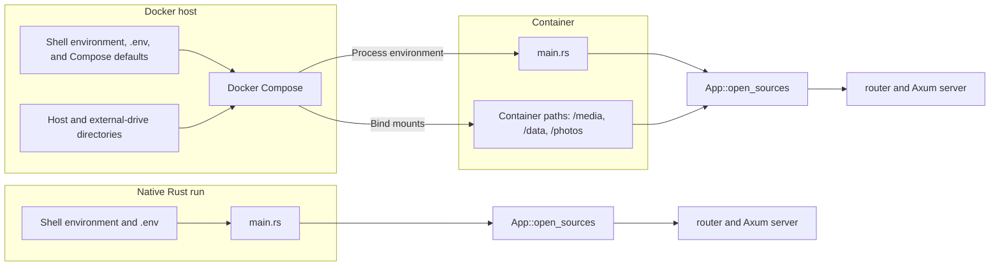
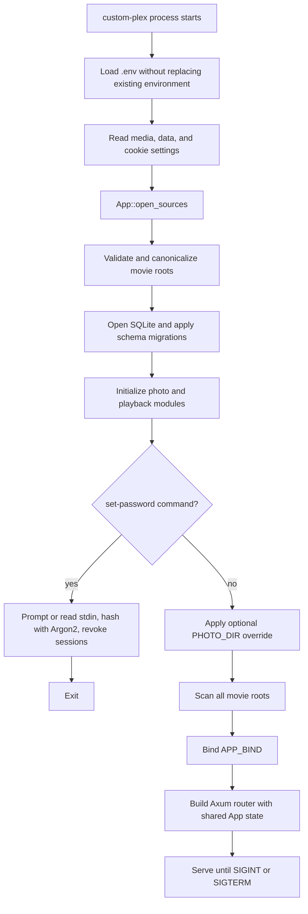
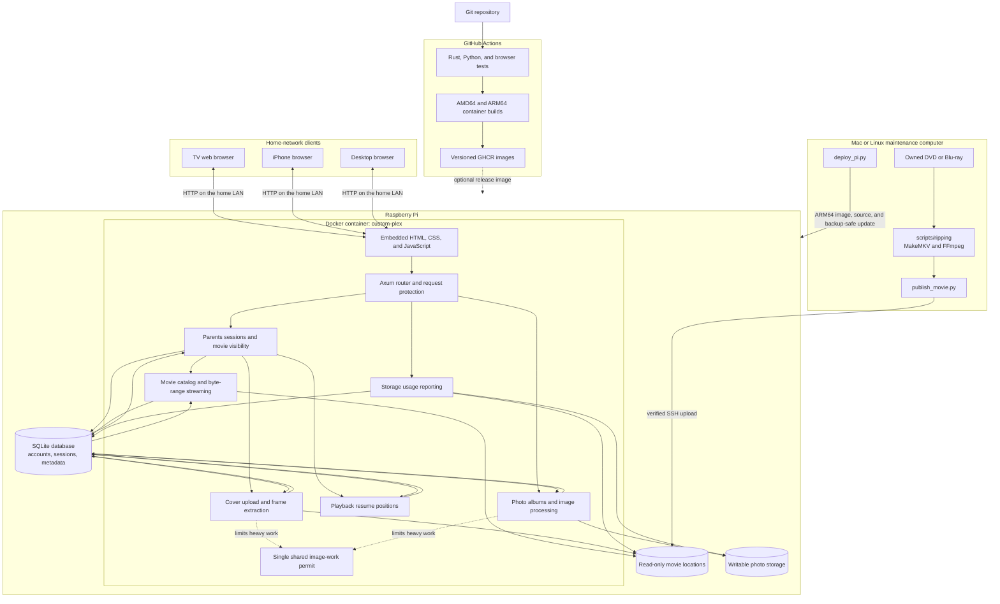
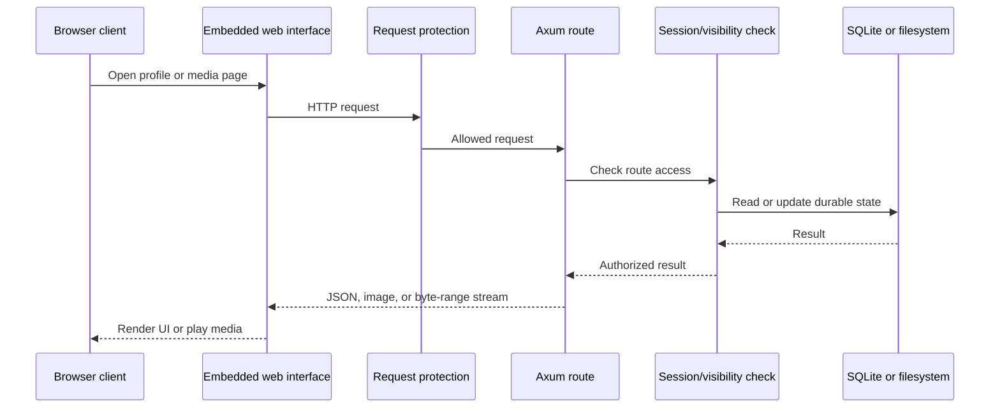

# Family Cinema architecture

## Purpose and boundaries

Family Cinema is a single-household media server. One Rust process serves the web interface, JSON APIs, video byte ranges, movie covers, and photo files. SQLite stores metadata. Movie files remain in configured read-only directories, while uploaded photos use a separate writable directory.

The application assumes a trusted home network. The running server does not provide TLS, internet-facing account management, live transcoding, disc ripping, or official Plex protocol compatibility. Separate repository tools can rip and convert authorized discs on a Mac or Linux computer before publishing the finished movie to the Pi.

## Runtime components

| Component | Location | Responsibility |
| --- | --- | --- |
| Process entry point | `src/main.rs` | Read environment settings, handle `set-password`, scan movies, bind the HTTP listener, and stop cleanly on signals. |
| Application and movie catalog | `src/lib.rs` | Own shared state, migrate the core schema, scan media roots, authenticate Parents, serve embedded assets, list movies, and stream videos. |
| Movie covers | `src/covers.rs` | Authorize cover access, normalize uploads, find sidecar artwork, extract FFmpeg frames, and cache JPEG results. |
| Playback progress | `src/playback.rs` | Validate and persist shared resume positions for visible movies. |
| Photo albums | `src/photos.rs` | Manage album/photo metadata, validate uploads, create previews, move/rename/delete items, and serve stored images. |
| Storage reporting | `src/storage.rs` | Report filesystem capacity while counting each underlying filesystem once. |
| Movie interface | `web/app.js` | Profiles, login, movie cards, covers, playback, progress events, storage meter, and shared dialogs. |
| Photo interface | `web/photos.js` | Album browsing, uploads, photo preview, descriptions, renaming, moving, and deletion. |
| HTML and styles | `web/index.html`, `web/style.css`, `web/controls.css` | Accessible page structure, dialogs, responsive layout, compact controls, and tooltips. |

Web assets are compiled into the Rust binary with `include_str!`. Editing a web file therefore requires rebuilding the binary or Docker image.

## Rust program configuration

The Rust application is one Cargo package with a small binary entry point and a reusable library:

- `src/main.rs` owns process configuration and lifecycle. It reads the environment, selects command or server mode, constructs `App`, scans the movie library, binds the listener, and handles shutdown signals.
- `src/lib.rs` owns the shared `App` state, core database schema, authentication, movie catalog, streaming, middleware, and top-level Axum router.
- `src/covers.rs`, `src/photos.rs`, `src/playback.rs`, and `src/storage.rs` each own one feature area and contribute handlers or a sub-router to the top-level router.

There is currently no separate configuration file parser or configuration struct. `main.rs` calls `dotenvy::dotenv()` and reads settings directly from environment variables. Existing process environment variables take precedence over values loaded from `.env`.

Native and container execution therefore reach the same Rust construction path. Only the layer that supplies environment values and filesystem paths changes.

### Process settings read by Rust

| Setting | Default | Used by | Behavior |
| --- | --- | --- | --- |
| `APP_BIND` | `127.0.0.1:8080` | `main.rs` | Address and port passed to `TcpListener::bind`. Compose overrides it with `0.0.0.0:8080` inside the container. |
| `MEDIA_DIR` | `media` | `main.rs` | Single movie root named `default`. It is ignored when non-empty `MEDIA_SOURCES` is configured. |
| `MEDIA_SOURCES` | empty | `main.rs` | JSON object mapping stable source names to server-visible paths, such as `{"default":"/media","archive":"/media-archive"}`. |
| `DATA_DIR` | `data` | `main.rs` and `App::open_sources` | Writable directory containing `library.sqlite3`; it also supplies the default photo directory. |
| `PHOTO_DIR` | `DATA_DIR/photo-albums` | `main.rs` and `photos` | Optional writable override for photo originals, previews, and thumbnails. An explicitly empty value is rejected. |
| `COOKIE_SECURE` | `false` | `main.rs` and authentication handlers | Adds the cookie `Secure` attribute only when its value is exactly `true`. Use it only when clients connect through HTTPS. |

The Compose-only settings `HOST_MEDIA_DIR`, `HOST_DATA_DIR`, `HOST_PHOTO_DIR`, `PORT`, and `PLEX_IMAGE` are not read by Rust. Docker Compose expands them into mounts, port mappings, and the process settings above. In particular, Rust sees `/media`, `/data`, and `/photos/photo-albums`; Compose decides which host or external-drive directories those paths represent.

### Startup and command modes

Normal server mode is `custom-plex` with no subcommand. `custom-plex set-password` updates the Parents password and exits without scanning or starting HTTP. The optional `--stdin` form supports non-interactive password input. Both modes open the same database, so password changes survive container recreation when the data mount is retained.

`App::open_sources` rejects an empty source map, invalid source names, missing directories, duplicate roots, and nested roots. It canonicalizes every accepted path before storing it. Database migrations run before requests can arrive. A normal startup then scans every configured movie location and marks database entries present or absent in one transaction.

### Shared application state

Axum receives a clone of `App` through `.with_state(app)`. Cloning `App` shares its synchronized resources rather than copying the database or catalog configuration.

| `App` field | Type and role |
| --- | --- |
| `db` | `Arc<Mutex<rusqlite::Connection>>`; one bundled-SQLite connection shared by handlers, with a five-second busy timeout and foreign keys enabled. |
| `media` | `BTreeMap<String, PathBuf>` of canonical, non-overlapping movie roots. The source name plus relative path is a movie's durable identity. |
| `data` | Canonical data directory used by SQLite, storage reporting, and default photo configuration. |
| `secure` | Whether authentication cookies receive the HTTPS-only `Secure` attribute. |
| `photos` | Canonical writable root for photo originals and generated browsing images. |
| `attempts` | `Arc<Mutex<Vec<i64>>>` containing recent login-attempt timestamps for the in-process rate limit. |
| `cover_work` | `Arc<tokio::sync::Semaphore>` with one permit shared by cover generation and photo decoding to constrain Pi memory usage. |

SQLite operations use the connection mutex and therefore execute one at a time. File and image work that could block Tokio is moved to blocking worker threads. Video and photo responses stream from disk through `ServeFile` instead of being loaded completely into memory.

### Router assembly

`router(app)` builds one Axum `Router`, merges the photo, playback, and storage sub-routers, adds the core session/movie/cover routes, installs the common protection middleware, and finally attaches `App` as shared state. The middleware rejects state-changing requests without `X-Requested-With: custom-plex` and adds cache and browser-security response headers. Authorization remains in each handler because access differs for Parents, Baby-visible movies, and password-free photo albums.

## System architecture

Solid arrows show normal runtime or maintenance data flow. The dotted release-image arrow is optional because `deploy_pi.py` can build and send an ARM64 image directly from the Mac.

## HTTP request flow

Every non-GET/HEAD browser request must carry `X-Requested-With: custom-plex`. This blocks ordinary cross-site form submissions. Routes then apply their own authorization:

- Parents-only: scanning, movie-title changes, and Baby approval changes.
- Visible-movie access: streaming, covers, and playback progress. Parents can access all present movies; Baby can access approved movies only.
- Password-free photo access: album and photo reads and changes, matching the product requirement for the Photo Album profile.

## Shared state and concurrency

`App` is cloned into handlers. Its SQLite connection and login-attempt history are protected by mutexes. Cover generation and photo decoding share a one-permit Tokio semaphore because both operations can consume substantial memory on a Raspberry Pi.

Image decoding and filesystem-heavy work move to blocking worker threads. Video and photo downloads use `ServeFile`, which supports streaming and HTTP range requests without reading complete files into memory.

## Data model

| Table | Purpose | Durable identity |
| --- | --- | --- |
| `account` | One Argon2 Parents password hash | Fixed row `id=1` |
| `sessions` | Random eight-hour login tokens | Token |
| `movies` | Source, relative path, title, approval, and presence | `(source, path)` |
| `covers` | Uploaded or generated JPEG plus source fingerprint | Movie ID |
| `playback_progress` | Shared position, duration, and update time | Movie ID |
| `albums` | Album name, description, and recent-use ordering | Album ID |
| `photos` | Album membership, title, description, storage token, and extension | Photo ID |

Schema changes are additive except for the historical one-time movie-table migration that introduced source names. Startup enables SQLite foreign keys and applies migrations before serving requests.

## Filesystem model

- Movie roots are canonicalized, must exist, and cannot overlap. Scanning ignores symlinks and records relative paths.
- Movie Docker mounts are read-only. The application never renames or deletes a movie.
- Each uploaded photo receives a random 32-character storage token. Its folder contains `original.<extension>`, `preview.jpg`, and `thumbnail.jpg`.
- Photo upload uses a staging directory followed by an atomic rename. Delete uses a temporary tombstone so database failures can restore the directory.
- Canonical-path checks prevent movie, cover, and photo requests from escaping configured roots.

## Authentication lifecycle

`set-password` hashes a password with Argon2 and deletes all sessions. Login verifies the hash on a blocking thread, creates a cryptographically random token, and stores an eight-hour expiry. Cookies are `HttpOnly`, `SameSite=Strict`, and optionally `Secure`. Switching profile logs Parents out in that browser.

Failed login attempts are limited to ten per rolling minute for the process. Restarting the process clears the in-memory attempt history but does not clear stored sessions.

## Deployment and rollback

Docker runs the process as UID/GID `10001`, with a read-only root filesystem and persistent bind mounts. `scripts/deploy_pi.py` builds an ARM64 image locally, streams the image and source to the Pi, and invokes `deploy_pi_remote.py`. The remote phase validates mounts, checks photo-directory writes as the container identity, stops the service, creates a consistent database backup, loads the image, recreates the service, and waits for health. It retains the previous image for rollback.

See [DEVELOPMENT.md](DEVELOPMENT.md) for verification commands and [API.md](API.md) for the HTTP contract.
